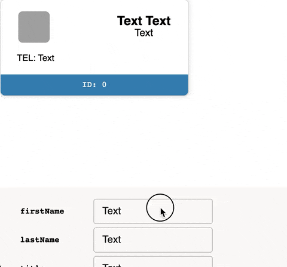

[](https://opensource.org/licenses/MIT)

## What is Looc?

Looc is a tool that allows you to "sandbox" and view your React components in browser independently from other existing components. With Looc you can manipulate the component's props and see how it reacts to updates. This is very useful for testing components without having to rebuild the whole project on every single change. You can think of it as a fast Storybook for single components. Looc can prepare your component in almost **zero** time during to the way it builds your components.

## Requirements

To be able to use Looc you need to make sure that:

1. You use Typescript. It only works on `.tsx` files. To understand why see the _How it works_ section below.

2. There is an **interface** inside the `.tsx` file that is named `xxxProps` where `xxx` is the name of your component. If your component is named `Card`, then you need an interface named `CardProps`.

3. Your component is a default export.

4. `npx` command should be available (for internal use).

## Usage

### Install

```bash
$ npm install looc --save-dev
# OR
$ yarn add looc -D
```

### Start

Use the `looc start` command to start the server that serves your sandboxed component:

```bash
$ yarn looc start src/component.tsx
# OR
$ npx looc start src/component.tsx
```

### Look

Now you can see and manipulate your component at `localhost:3000`:
<br>
<br>

<p align="center"></p>

## CLI commands

### `start <filepath>`

The `filepath` must be relative to current working directory.

Flags:

- `--css` : Use if your component imports `.css` files.

```javascript
import "styles.css";
```

- `--css-modules` : Use if you rely on CSS modules.

```javascript
import styles from "styles.css";
```

- `--emotion` : Use if you style your components with [emotion](https://github.com/emotion-js/emotion).

* `--styled-components` : Use if you style your components with [styled-components](https://github.com/styled-components/styled-components).

- `--without-props`: Use this if you components does not need props.

## How it works

Internally, Looc uses [tsx-ray](https://github.com/jlkiri/tsx-ray) to parse the `.tsx` file and extract interfaces from it. This information is used to decide which props can be passed to your component and what type they should be.

Next, if you use libraries like [emotion](https://github.com/emotion-js/emotion) or [styled-com ponents](https://github.com/styled-components/styled-components), Looc uses [snowpack](https://github.com/pikapkg/snowpack) to download ESM versions of those libraries so it can import them directly from browser.

This allows to reduce the build-rebuild time to almost zero (almost because Looc still needs to resolve and bundle imports of other components and because Typescript needs to be compiled). Still, it is **very** fast compared to how much you need to wait if you use Storybook and your project is big. Looc uses [rollup](https://github.com/rollup/rollup) to do the compilation and bundling.

When your component is loaded, you can confirm it in the browser window. Looc provides a simple UI for manipulating props. The UI is generated automatically based on prop types. Since there is no way to know which props are required and which aren't, default values are set for every single prop based on its type.

Here's a brief explanation of which `<input>` is generated based for which prop type:

- `string`: `<input type="text">` <input type="text" value="Text">
- `number`: `<input type="number">` <input type="number" value="0">
- `string[]`: `<input type="text">` <input type="text" value="Text, Text, Text">
- `number[]`: `<input type="text">` <input type="text" value="0, 1, 2">
- `boolean`: `<input type="checkbox">` <input type="checkbox">

Union types (especially literals) map very nicely to a `<select>`. For example a `"round" | "squared"` type is generated as a `<select>` with options `round` and `squared`: <select><option value="round">round<option value="squared">squared</select>

### FAQ

- **Q**: Can I use global CSS styles?
  **A**: If your component relies on some global CSS, then the styles will not apply unless the CSS file is imported directy into the file with component.

* **Q**: Can I use external libraries other than `emotion` and `styled-components`?
  **A**: If your component relies on external libraries other than those allowed by Looc, currently they won't be bundled.

- **Q**: How are array types treated?
  **A**: If prop type is an array then the value in the generated `<input>` is automatically split by `,`, which allows you to input multiple values with a single input. If a number array is required than input values are automatically converted with `Number`.

* **Q**: I have some logic that relies on external libraries but that is not crucial for visual testing. How do I detect that my component is in a sandbox and prevent this logic from applying?
  **A**: A loaded component is provided with a special `boolean` prop `__LOOC_DEBUG__` which is always `true` if your component is loaded with `looc start`. You can use it to conditionally prevent any logic from applying.

- **Q**: I get the `No interfaces found!` error.
  **A**: It could be that your components does not need props at all. To tell Looc that it does not need to look for interfaces you need a `--without-props` flag.

## Contribution

This project uses Yarn 2 and its PnP feature (plug-n-play). All dependencies are kept inside the repository. The code is written entirely in Typescript. Looc project is a monorepo.

Feel free to open an issue!

### Structure

- `looc`: This workspace contains the code for CLI.

* `looc-e2e`: This workspace is used only to test the CLI on real world components.

- `looc-loader`: This workspace is the code for the `Loader`, a React component that is used to import and manipulate user's components.

### Develop

1. Fork this repository
2. Clone your fork to work on it locally
3. Make changes
4. Run `yarn build` and make sure that it builds without crash (there will be Yarn 2 specific warnings that can be ignored)
5. Run `yarn e2e:start` to make sure real code works with `looc`
